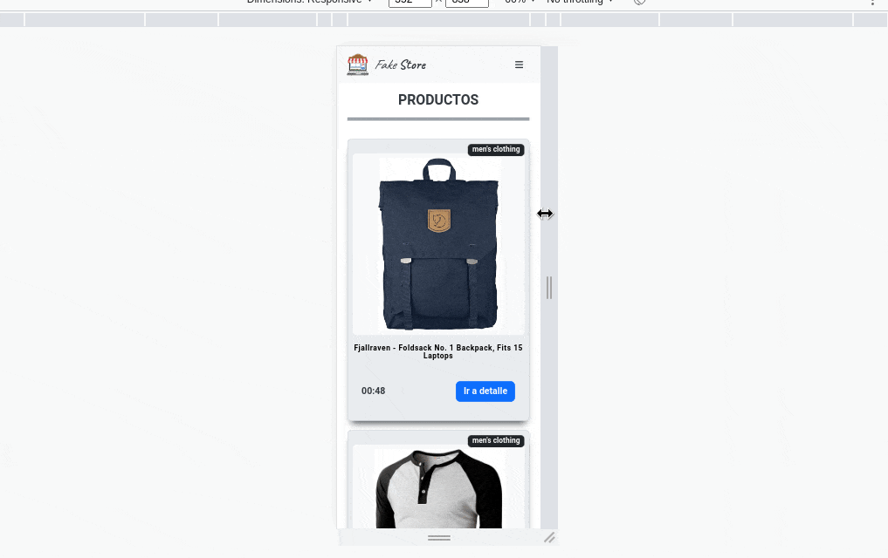

# Assessment Make It Real

Este proyecto consiste en crear una aplicación de react que consume la api de **Fake Store** para crear una **página Home** donde se muestran todos los productos y una **página detalle** donde se pueden observar los detalles del producto seleccionado.

En la home los productos tienen un countdown aleatorio de 1 a tres minutos que habilita o deshabilita el botón para ir a la página de detalle.

Para el about se utilizó la api de github para recuperar la imagen de usuario, y el número de repositorios.

## Rutas

- [Store](./src/store/index.js)
- [Home](./src/pages/Home.jsx)
- [About](./src/pages/About.jsx)
- [Product Detail](./src/pages/ProductDetail.jsx)

## Dependencias

- axios
- sasss

### Depenendicas de desarrollo

- Eslint
- Prettier
- Husky

## Ruta de Carpetas src

- Assets
- Components
- Pages
- Styles
  - abstract
  - base
  - components
    -pages
